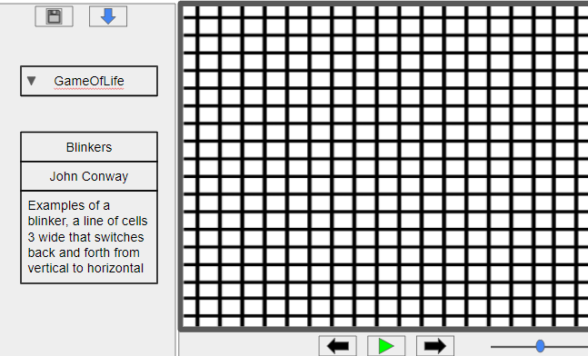
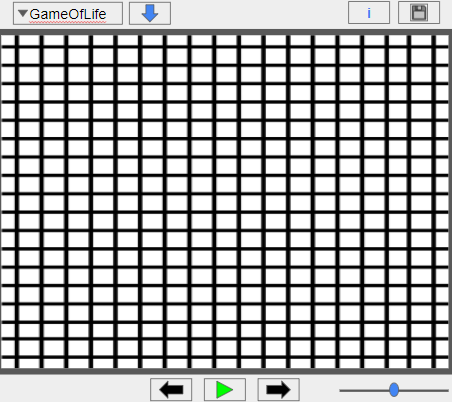

# Cell Society Design Plan

### Team Number 12

### Names

- Daniel Feinblatt
- Mazen Selim
- Ryan Wolfram
- Jerry Worthy

## Design Overview

#### Overall design goals

We aim to implement a Model, View, Controller (MVC) design with communication between Model and View
only through the controller and the observer-observable relationship. Our goal is to design the
Model, View, and as much of the controller as possible such that they can be used for any cell
automata simulation. We want to make the app as extendable as possible to be able to perform many
cell automata simulations and abide by the open-close principle.

#### Classes, their behavior and relationships (**not** instance variables)

[Here is a graphical look at our design](https://lucid.app/lucidchart/5b94a060-c7f4-4513-964f-82bc454fa1cc/edit?viewport_loc=-27%2C-1342%2C3066%2C1418%2C0_0&invitationId=inv_3566efbe-bce3-456a-b3d3-ee3867f27a4c)

## Design Details

#### Use Cases

Basic Course of Action:

- User starts application and selects their language.
- User is presented with a default grid for the simulation with the default simulation being game of
  life.
- User can use dropdown to select the type of cell automata simulation they want which will clear
  the grid and display a new default grid.
- User can click the squares to manually customize their starting states.
- User can edit cell state colors using an edit colors button.
- User can edit simulation information by clicking on the information button.
- User can save the current state and information to a new .sim file.
- User can choose to upload a `.sim` file containing simulation info.
- Upon upload, a new grid is built with the given initial state.
- User can press the play button to have the simulation autoplay or can step through the simulation
  one iteration at a time using the forward and backward buttons.
- User can use the slider to adjust the autoplay animation speed.

#### Extension Cases

* What commonalities will be factored out into superclasses?
    * The main commonalities revolve around the similarities between running each simulation.
      Because each simulation will involve looping through each cell and deciding a new state we
      will factor basic state changing functionality
      into a state handler superclass that will be inherited by child state handlers for each
      simulation. This is also true for the state classes. Each
      simulation will utilize different state classes that could have different information
      contained within, therefore they will all implement
      a state interface.
* How will differences be handled when superclasses are extended?
    * Each simulation has a different state transition function that extends an abstract state
      transition function, this state transition function is
      contained within the controller, and is changed when the user selects a different simulation
      type either be selecting the simulation from the
      combo box or uploading a simulation file. This information is passed to the controller when it
      is changed. These different state handlers wll also use the different state classes belonging
      to their respective simulation types. Adding a new
      simulation therefore should only require extending the state handler superclass to a new state
      handler, creating new state classes that implement
      the state interface, and adding a properties file that contains the colors for each new cell
      state and that is named after the new simulation name.

## Design Considerations

#### Design Issue #1: Deciding with what granularity we should create our model and view structure

* Design #1 Tradeoffs
    * Description: One model and one view for the project
    * Pros
        * Limits complexity of the design
    * Cons
        * Risk of creating a monolothic design
        * Less encapsulation of data
        * More likely to break the open-closed principle upon implementing other simulation types
* Design #2 Tradeoffs
    * Description: A model and a view for each square in the simulation grid
    * Pros
        * Better use of encapsulation. Squares contain their own state and UI information
          separately.
        * More extendable. Can create different types of squares for different simulations if needed
        * Less monolothic design. Classes are less likely to become bloated.
    * Cons
        * Greater complexity regarding communication between objects

* Justification for choice
    * Design #2 has much more flexibility and gives us greater ability to follow OOP design
      principles including the open-closed principle, dependency-inversion principle, single
      responsibility principle, and interface separation principle. This design will work better in
      allowing us to implement other cell automata simulations beyond game of life.

#### Design Issue #2

What should be designed for use with all simulations and what should be designed for use with just
one simulation.

* Design #1 Tradeoffs
    * Description: Create a different model for each simulation
    * Pros
        * Can take advantage of polymorphism by having each simulation-specific model extend a super
          class model.
        * Likely simpler logic implementation.
    * Cons
        * Less extendable. Requires more work to add a new simulation
        * Less reuse of code

* Design #2 Tradeoffs
    * Description: Have a separate state handler class for each simulation and keep the model the
      same for all simulations
    * Pros
        * Better exploitation of commonalities among the cell automata simulations
        * More extendable. Only requires implementing a new state handler to define the state
          transition rules to create a new simulation type.
        * Also can take advantage of polymorphism by having each simulation-specific state handler
          extend a super class or interface state handler.
    * Cons
        * More challenging to implement for simulations that change state in dramatically different
          ways.
* Justification for choice
    * Design #2 has similar advantages to Design #1 plus the additional advantages of greater code
      reuse and thus being more extendable.

#### Data Structure Implementation Change

* Implementation #1
    * Description: Creating a 2D array of cell models that is used in the model.

    * Classes possibly affected:
        * CellSpawner

    * Methods possibly affected
        * CellSpawner.initializeCell()
        * CellSpawner.getCell()

* Implementation #2
    * Description: Creating a list of lists of cell models that is used in the cell.

    * Classes possibly affected
        * CellSpawner

    * Methods possibly affected
        * CellSpawner.initializeCell()
        * CellSpawner.getCell()

    * Justification for how implementation choices is hidden: We have created three layers of
      classes
      that represent our data structure in the back end. Firstly, a grid model class holds a
      neighborhood loader class that has access to all
      neighborhoods of cells, where a neighborhood is a class that defines a center cell model and
      all 8 of its neighbors. For example, when the controller loads a new csv, the array of cell
      models only exists when they are first created by a cell spawner class and are passed
      individually
      to the neighborhood loader, which means there is no method that takes in the actual data
      structure that holds
      the cell models as a parameter, only individual cell models. The only methods that would be
      affected
      by changing the data structure would be in the cell spawner class as it initializes it and
      passes the cell models to other
      classes from it.

#### File Format Implementation Change

* Implementation #1
    * Description: The sim file is ordered differently.

    * Classes possibly affected
        * There are no classes affected.

    * Methods possibly affected
        * There are no methods affected.

* Implementation #2
    * Description: The sim file has extra information.

    * Classes possibly affected
        * GameDisplayInfo
        * SimParser
        * SimFileKeys

    * Methods possibly affected
        * SimParser.getDisplayInfo()

* Justification for how implementation choices is hidden: It does not matter what the format of
  the sim file is because it is read similarly to a property file. This means that no information
  about the format needs to be passed to the parser. Also, all the information read by the parser is
  passed back as a record containing all the information. If the sim file contains extra information
  that information is not simply passed to the record. The record class will need to be changed to
  account for this.
  As well as the method for parsing the sim file.

#### JavaFX "Grid" Component Implementation Change

* Implementation #1
    * Description: The cell views are contained in a 2D array.

    * Classes possibly affected
        * GridView

    * Methods possibly affected
        * GridView.resizeGrid()
        * GridView.setDimensions()
        * GridView.addCell()

* Implementation #2
    * Description: The cell views are contained in an ArrayList.

    * Classes possibly affected
        * GridView

    * Methods possibly affected
        * GridView.resizeGrid()
        * GridView.setDimensions()
        * GridView.addCell()

    * Justification for how implementation choices is hidden: Because the controller both
      instantiates and links the individual
      cell models to the individual cell views during the set-up, and these cell views are passed
      to the grid view that contains them one at a time, the grid view never has to accept or pass
      the type of data structure that it will internally store the cell views in. It only stores
      them internally to handle resizing and resetting dimensions. Thus, these cell views can be
      stored within
      any data structure within the grid view class, a data structure that will never be passed to
      other classes.

## User Interface

Initial Design Idea:  
This was our initial idea for the UI, but we found that the simulation information did not need to
take up so much space

Final Design Idea:  
This final design will utilize a pop-up dialog window to show extra information about the simulation

## Team Responsibilities

#### Primary Responsibilities

* Team Member #1
  Mazen Selim - Controller-model connection
* Team Member #2
  Ryan Wolfram - Model
* Team Member #3
  Daniel Feinblatt - Controller and Object-oriented design
* Team Member #4
  Jerry Worthy - UI/Views

#### Secondary Responsibilities

* Team Member #1
  Mazen Selim - Model and state handling
* Team Member #2
  Ryan Wolfram - Controller-model connection
* Team Member #3
  Daniel Feinblatt - Model
* Team Member #4
  Jerry Worthy - Design

#### Schedule Plan

* 10/12 - begin overall design
* 10/14 - UI, Model, and Controller skeleton, continue designing
* 10/15 - non-functional UI
* 10/17 - semi-functional Model, UI, and Controller, finalize design
* 10/18 - combine semi-functional Model, UI, and Controller
* 10/20 - make game of life fully functional, make save file fully functional file
* 10/22 - fully tested game of life, more robust error-handling with tests, implement reflection for
  state-handler
* 10/24 - implement new simulation types, add color editing to UI
* 10/25 - address new tasks
* 11/1 - finalize code